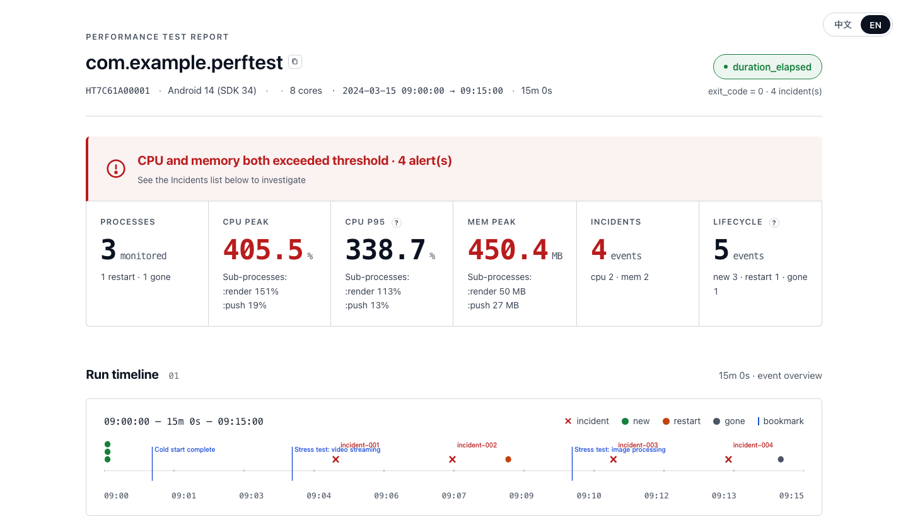
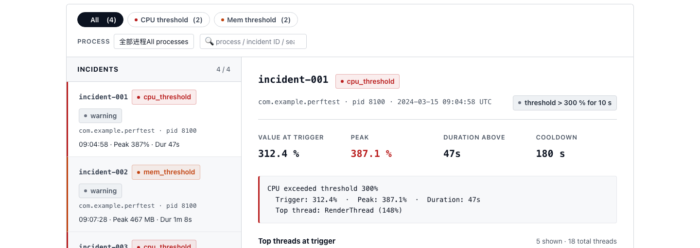
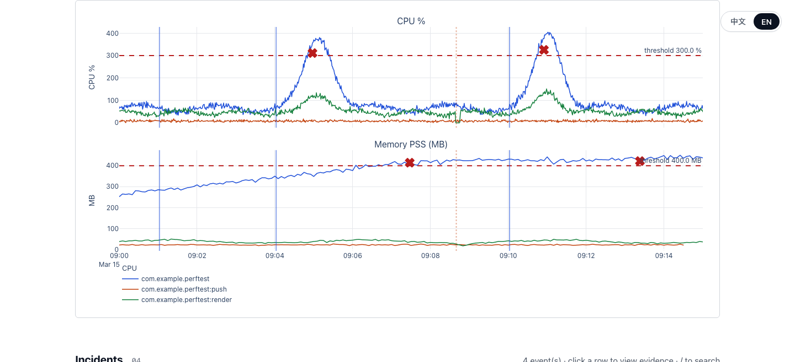
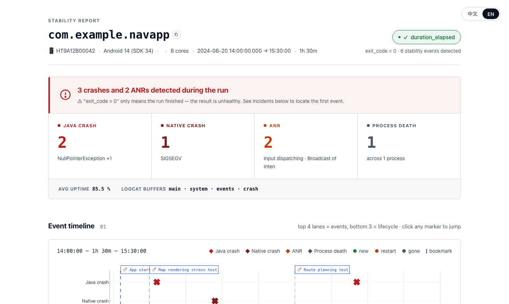
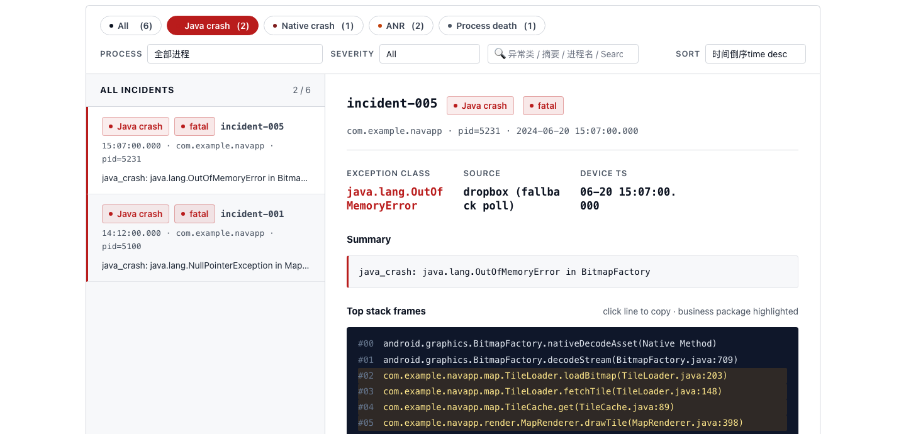
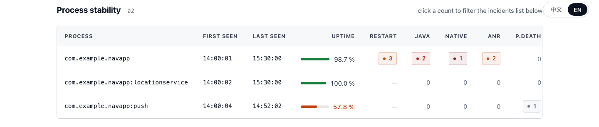

# Android APK Auto-Test Suite

**[中文](README.zh.md)** | **English**

> Two independent Python + adb tools for automated Android APK testing — no app modification, no root required.

---

## Tools at a glance

| Tool | What it detects | Module | Path |
|---|---|---|---|
| **perf_auto_test** | CPU spikes · memory leaks · threshold breaches | `pat` | `perf_auto_test/` |
| **stability_auto_test** | Java crash · Native crash · ANR · process death | `sat` | `stability_auto_test/` |

Both tools share the same design principles:

- **Package-agnostic** — any third-party app or system service, just the package name
- **Non-invasive** — no APK modification, no root, no debuggable build required
- **Long-run stable** — hourly rolling CSV/log, adb retry with backoff, handles 1 h–24 h runs
- **Three modes** — standalone CLI / Python library embedded in a larger test framework / Claude Code Skill
- **AI-ready** — structured `report.json` + interactive `report.html` (Plotly)

---

## Report preview — perf_auto_test

### Verdict bar · KPI cards · run timeline


At-a-glance verdict (all-clear or breach details), six KPI cards (processes monitored, CPU peak / p95, memory peak, incident count, lifecycle events), and an interactive run timeline. Incident markers (×) and lifecycle dots are hoverable for instant popovers; clicking an incident marker jumps straight to its detail.

### Incident list + per-incident deep-dive


Filter by type (CPU threshold / memory threshold), search by process or incident ID. The master-detail panel shows trigger value, peak, time above threshold, and — depending on type — either the top CPU threads with usage bars or the memory category breakdown from `dumpsys meminfo`.

### CPU & memory time-series (Plotly)


Interactive Plotly charts for every monitored process: CPU% (single-core normalised) and memory PSS in MB. Red dashed threshold lines and incident markers overlay directly on the data. Click any marker to jump to its incident detail.

---

## Requirements

- Python 3.9+
- `adb` available in PATH (`adb devices` shows the target device)
- Target app already running on device

---

## Claude Code Skill integration

Both tools ship as **Claude Code Skills** — trigger them with natural language inside Claude Code:

```
/perf-auto-test com.example.app 30m
/stability-auto-test com.example.app 1h
```

Claude handles execution, opens the HTML report, and outputs a structured test summary.

Skill definitions: [`perf_auto_test/SKILL.md`](perf_auto_test/SKILL.md) · [`stability_auto_test/SKILL.md`](stability_auto_test/SKILL.md)

---

## perf_auto_test — Performance Monitoring

Auto-discovers all processes for a given package, collects CPU% and memory PSS in parallel, triggers automatic dumps (thread snapshot / heap dump) when thresholds are breached.

```bash
cd perf_auto_test/scripts
pip install -r requirements-dev.txt

python -m pat \
  --package com.example.app \
  --duration 30m \
  --cpu-threshold-percent 60 \
  --mem-threshold-pss-mb 400 \
  --output ./reports/run1
```

**Output**

```
reports/run1/
├── report.json         ← authoritative result (AI / CI readable)
├── report.html         ← Plotly interactive charts (CPU / Mem / lifecycle)
├── *.csv               ← raw time-series, hourly rotation
└── incidents/
    ├── cpu_<ts>_<proc>_pid<n>.json   ← top-N threads + trigger metadata
    ├── heap_<ts>_<proc>_pid<n>.json  ← memory categories + evaluation
    └── ...
```

Full docs: [`perf_auto_test/README.md`](perf_auto_test/README.md)

---

## stability_auto_test — Stability Monitoring

Streams logcat and polls dropbox in parallel, captures Java/Native crash, ANR, and process-death events, saves incident snapshots (logcat slice + tombstone/ANR trace), and produces a structured report with an interactive event timeline.

> **Note**: This tool does not launch the app — the target process must already be running.

```bash
cd stability_auto_test/scripts
pip install -r requirements-dev.txt

python -m sat \
  --package com.example.app \
  --duration 30m \
  --output ./reports/run1
```

**Output**

```
reports/run1/
├── report.json               ← authoritative result (AI / CI readable)
├── report.html               ← Plotly event timeline + process stability table
├── events_*.csv              ← event stream, hourly rotation
├── lifecycle_*.csv           ← process lifecycle, hourly rotation
├── logcat_*.log              ← raw logcat, hourly rotation
└── incidents/
    ├── java_crash_<ts>_<proc>_pid<n>.txt   ← logcat slice (human-readable)
    ├── java_crash_<ts>_<proc>_pid<n>.json  ← exception class + top frames + metadata
    ├── native_crash_<ts>_<proc>_pid<n>.tombstone  (when accessible)
    ├── anr_<ts>_<proc>_pid<n>.trace               (when accessible)
    └── ...
```

Full docs: [`stability_auto_test/README.md`](stability_auto_test/README.md)

---

## Report preview — stability_auto_test

### Verdict · event type counters · run timeline


Verdict bar summarises the run in plain English ("3 crashes and 2 ANRs detected"). Four counters break down events by type — Java crash, Native crash, ANR, process death — with a one-line hint per type. The Plotly event timeline below places every incident on a dedicated lane, interleaved with lifecycle markers (new / restart / gone) and bookmark lines.

### Incident list + crash detail (Java exception + stack trace)


Filter by event type, severity, process, or free-text search. The master-detail panel shows exception class (highlighted as a link), source (logcat / dropbox), device timestamp, a one-line summary, and the full Java or native stack with business-package frames highlighted in amber. Evidence files (logcat slice, tombstone, ANR trace) are linked directly.

### Process stability table


Per-process uptime bar (green → orange as uptime drops), restart count, and per-type event counts as clickable chips that jump straight to the filtered incident list.
